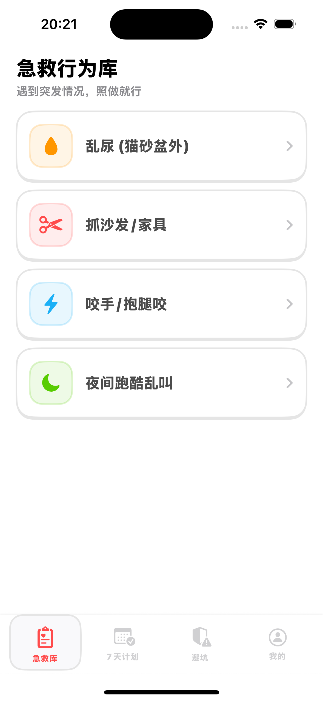
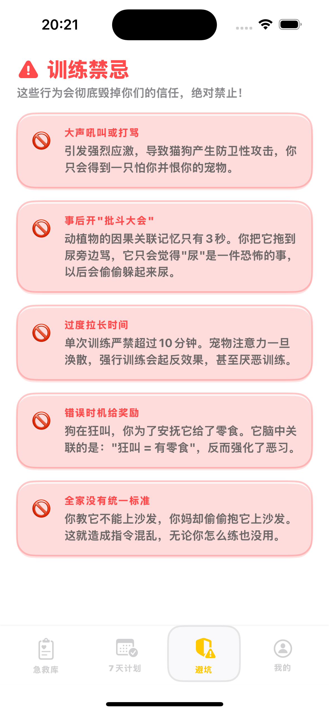
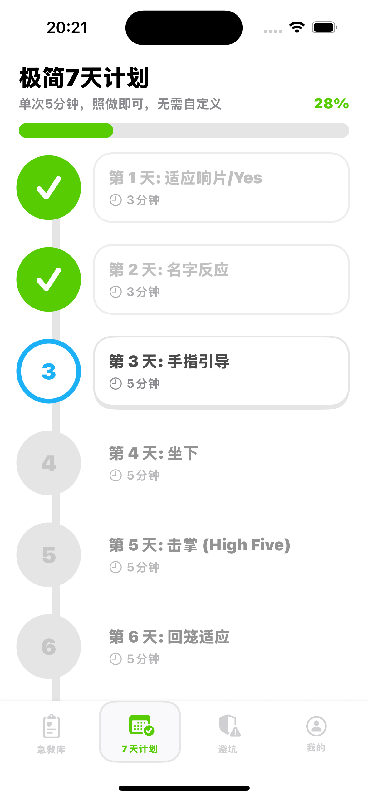
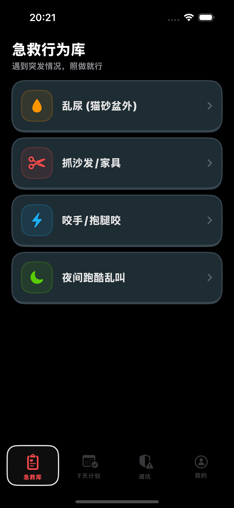
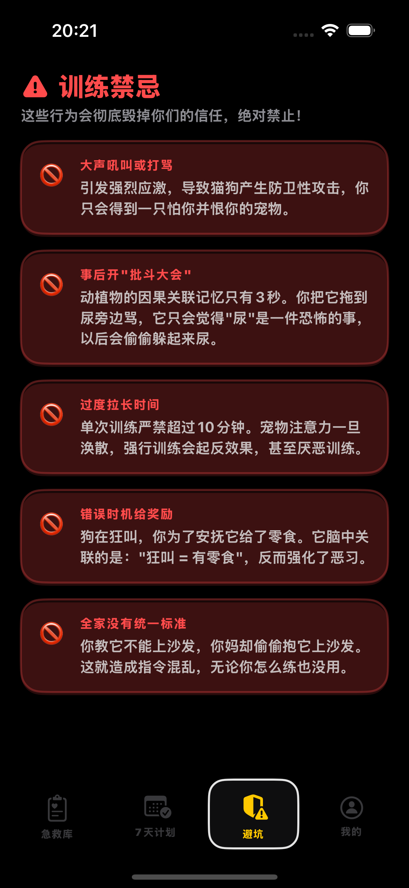
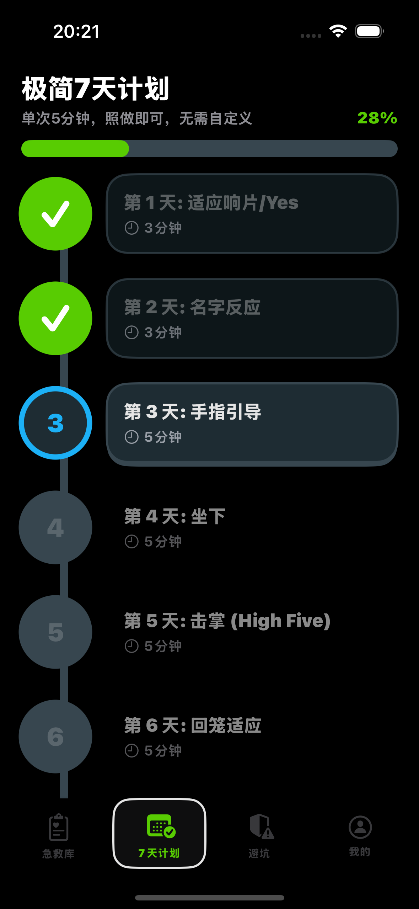
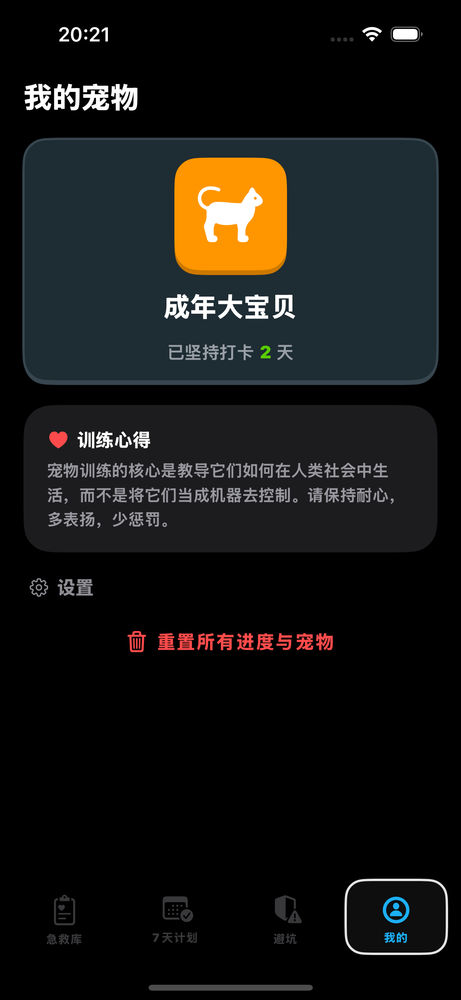

# DuoPet Trainer App 🐕🐱

一款受 Duolingo 设计风格启发的宠物训练应用，帮助宠物主人有效训练他们的狗狗和猫咪。

## 功能特点 ✨

- **宠物选择**：支持狗狗和猫咪，包含幼年和成年选项
- **紧急指南**：常见宠物紧急情况的快速参考，附详细步骤说明
- **训练计划**：结构化的每日训练计划，包含提示和时长指南
- **禁忌训练**：学习训练宠物时不应该做什么
- **Duolingo 风格设计**：鲜艳的色彩、3D 按钮和友好的界面

## 截图





## 技术栈 🛠️

- **框架**：SwiftUI
- **语言**：Swift 5.0+
- **平台**：iOS 16+
- **状态管理**：Combine + EnvironmentObject
- **设计系统**：自定义 Duolingo 风格调色板和组件

## 快速开始 🚀

### 前提条件

- Xcode 15+
- iOS 16+ SDK

### 安装步骤

1. 克隆仓库：
```bash
git clone https://github.com/yourusername/duopet-trainer-app.git
```

2. 在 Xcode 中打开项目：
```bash
open duopet-trainer-app.xcodeproj
```

3. 在模拟器或设备上构建并运行。

## 项目结构 📁

```
duopet-trainer-app/
├── Assets.xcassets/          # 应用图标和资源
├── Models/                   # 数据模型
│   ├── PetData.swift         # 模拟数据
│   └── PetModels.swift       # 类型定义
├── Store/                    # 状态管理
│   └── AppState.swift        # 全局应用状态
├── Theme/                    # 设计系统
│   └── DesignSystem.swift    # 颜色、样式、组件
├── Views/                    # UI 视图
│   ├── EmergencyView.swift   # 紧急指南页面
│   ├── MainTabView.swift     # Tab 栏容器
│   ├── PetSelectionView.swift# 宠物选择页面
│   ├── PlanView.swift        # 训练计划页面
│   ├── ProfileView.swift     # 用户资料页面
│   └── TabooView.swift       # 禁忌训练页面
├── ContentView.swift         # 根视图
└── duopet_trainer_appApp.swift # 应用入口
```

## 设计系统 🎨

应用采用 Duolingo 风格的调色板：

| 颜色 | 十六进制 | 用途 |
|-------|----------|------|
| Duo Green | #58CC02 | 主按钮、成功状态 |
| Duo Blue | #1CB0F6 | 次要按钮、信息提示 |
| Duo Yellow | #FFC800 | 警告、高亮 |
| Duo Orange | #FF9600 | 重要提示、注意事项 |
| Duo Red | #FF4B4B | 危险、错误 |

## 使用说明 📱

1. **选择宠物**：选择狗狗或猫咪，并选择年龄
2. **浏览训练计划**：遵循结构化的每日训练计划
3. **紧急参考**：访问常见宠物紧急情况的快速指南
4. **学习禁忌**：了解训练过程中需要避免的行为

## 贡献指南 🤝

欢迎贡献！请随时：
- 提交 bug 报告
- 建议新功能
- 创建 Pull Request

## 许可证 📄

本项目仅供教育目的使用。

---

🐾 训练愉快！